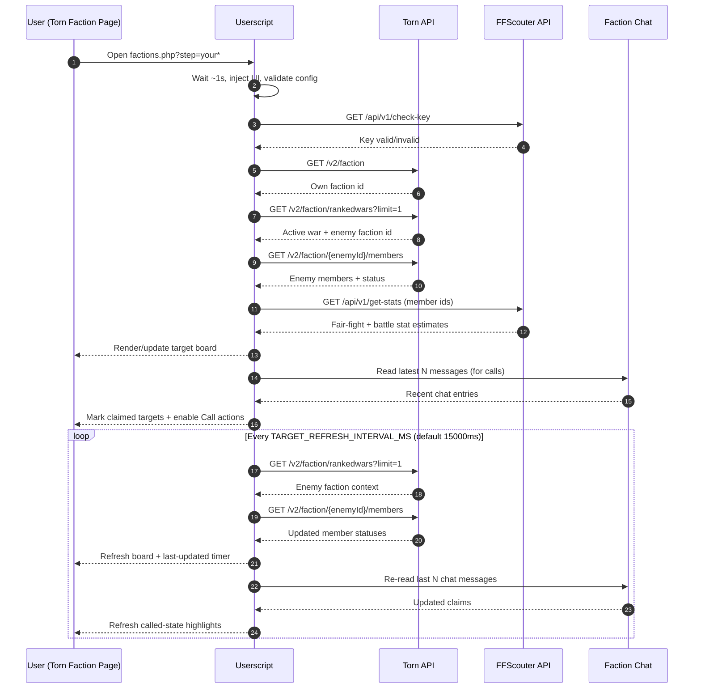

# Torn War Targets Userscript

A Tampermonkey/Greasemonkey userscript that augments Torn's faction page with a live **war target board** driven by Torn API + FFScouter data.

It injects a custom panel on `factions.php?step=your*`, ranks viable enemy members by war usefulness, and integrates with faction chat to coordinate calls.

## Core capabilities

- Discovers the current ranked-war enemy faction from Torn API.
- Fetches enemy faction members and enriches them with FFScouter metrics.
- Filters non-actionable targets (Federal / Traveling / Abroad).
- Renders target cards with:
  - availability dot (online / idle / offline)
  - status line (including hospital countdown)
  - battle stat estimate
  - fair fight score
- Sorts targets by operational priority:
  1. `Okay` targets first (higher fair-fight first)
  2. `Hospital` targets second (soonest out first)
  3. everything else afterwards
- Adds **Call** workflow:
  - one-click post to faction chat
  - parses recent chat messages for target claims
  - highlights claimed cards (`is-called`) and self-claims (`is-yours`)
  - suppresses duplicate calls while a target is actively claimed
- Auto-refreshes target data and keeps a `Last updated` age indicator.

## Architecture overview

The script is a single-file userscript (`userscript.js`) structured into a few internal domains:

### 1) Configuration surface (safe to modify)

At the top of the script:

- `MAX_FAIR_FIGHT` — upper fair-fight threshold for displayed targets.
- `LAST_N_MESSAGES_TO_CHECK_FOR_DIBS` — chat window size used for call parsing.
- `CALL_FULFILLMENT_TIMEOUT_MINUTES` — claim expiration window.
- `TARGET_REFRESH_INTERVAL_MS` — polling period for background refresh.
- `ENABLE_DEBUG_LOGS` - verbose logging

Everything below the `DO NOT TOUCH` divider is considered implementation internals.

### 2) State containers

- `headerState` — last update timestamp + timers.
- `targetState` — card registry, call tracking, parsed message cache, per-target transition memory.
- `chatState` — references/observer for faction chat list mutations.
- `statsCache` — FFScouter stats cache keyed by player id.

### 3) Data pipeline

`loadTargets()` orchestrates the whole fetch/render flow:

1. `fetchFactionInfo()` -> resolve your faction id.
2. `fetchEnemyFaction()` -> resolve active ranked-war opponent.
3. `fetchEnemyTargets()` -> get opponent members + enrich with FFScouter stats.
4. `renderTargetGrid()` -> update UI incrementally.

Notes:

- FFScouter batch stats are fetched once initially and cached.
- Auto-refresh reuses cache (`useScouter: false`) to reduce repeated external calls.

### High-level sequence (API + loop)

### 4) UI layer

- `renderNewElements()` injects header/content containers into the faction page.
- `ensureTargetStyles()` creates an inline stylesheet once.
- `renderTargetCard()` creates card DOM; `updateTargetCard()` applies state updates.
- `updateLastUpdatedText()` + interval timer maintain elapsed-time display.

### 5) Chat-call coordination

- Observers attach to Torn chat root/list via `MutationObserver`.
- `collectLastMessages()` captures the latest N chat entries.
- `extractCallEntry()` interprets messages that look like calls (`<name>` or `<name> in <minutes>`).
- `rebuildCalledState()` and `refreshCallStyles()` keep UI synchronized with active claims.

## API contracts used

### Torn API

- `GET /v2/faction` -> own faction basic info.
- `GET /v2/faction/rankedwars?limit=1` -> current active ranked war + factions.
- `GET /v2/faction/{enemyId}/members` -> enemy member roster + statuses.

### FFScouter API

- `GET /api/v1/check-key` -> key validation.
- `GET /api/v1/get-stats` -> fair-fight and BS estimates for member ids.

## Installation

1. Install a userscript manager:
   - Tampermonkey (recommended)
   - Violentmonkey / Greasemonkey
2. Create a new script and paste `userscript.js`.
3. Edit config constants at the top of the file.
4. Save and open Torn faction page and follow instructions:
   - `https://www.torn.com/factions.php?step=your*`

## Runtime behavior and performance

- Initial boot waits briefly (`setTimeout(..., 1000)`) before injecting UI and validating key.
- Target refresh defaults to every `15000ms`.
- Last-updated label ticks every second.
- Claim and message caches are bounded by timeout and max-message limits.

## Operational caveats

- The script currently targets Torn web DOM class/id patterns (which may change).
- It relies on userscript `GM_xmlhttpRequest` privileges (`@grant GM_xmlhttpRequest`).
- Supports TornPDA request fallback via `PDA_httpGet` when GM networking APIs are unavailable.
- If API key validation fails, content panel shows an explicit invalid-key message and no polling starts.

## Security notes

- The API key is embedded in plaintext in the userscript source.
- Treat your local userscript storage/device as sensitive.
- Do not publish your script with a real key committed.

## Development notes

- Keep the userscript metadata block intact (`// ==UserScript== ...`).
- Prefer small, isolated helper functions (current codebase follows this style).
- If updating chat parsing, ensure `extractCallEntry()` and cache-pruning logic stay aligned.
- If Torn DOM changes, first revalidate selectors used by:
  - `renderNewElements()`
  - `getFactionChatList()`
  - `getFactionChatTextarea()`

## License

Unlicense. See `LICENSE`.
